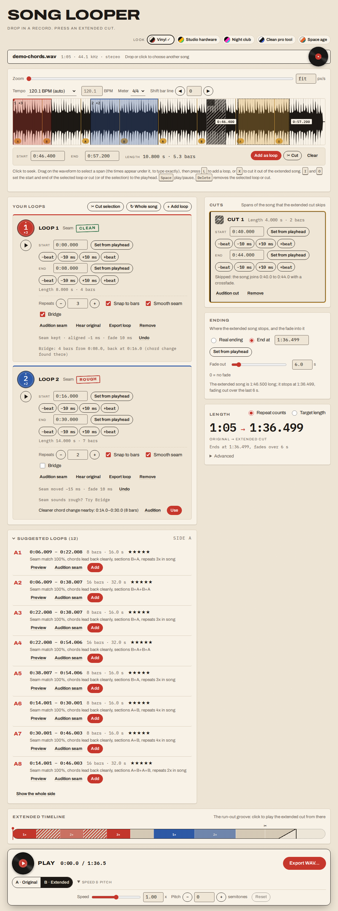

# Song Looper

Drop in a song. The app finds sections that loop cleanly, you pick one or more of them, say how many times
each should repeat, preview the result, and export an extended version of the song as a WAV.

Everything runs in the browser. There is no server, no API key and nothing is uploaded.



## What it does

- Loads mp3, wav, m4a/aac, flac, ogg or anything else your browser's `decodeAudioData` accepts, and keeps the
  file's native sample rate and channel count for rendering and export. When the browser can't decode an m4a or
  .aac file (Chrome and Firefox never decode Apple Lossless, and some Chromium and Linux Firefox builds lack AAC),
  a bundled decoder takes over. It loads only when needed. Copy-protected files (Apple Music downloads) get a
  clear error, since nothing can decode them.
- Analyses the song in a Web Worker: beats, tempo (with a half/double override), bars, sections (A, B, C, ...)
  and a ranked list of loop suggestions, each with a one-line reason.
- Shows the waveform (wavesurfer.js v7 + Regions plugin) with the beat and bar grid and section markers. Drag on
  it to select a span, press `L` to turn the selection into a loop, drag edges to fine-tune (they snap to bars, or
  beats; hold Shift to turn snapping off). Loops cannot overlap.
- Each loop has its own repeat count (1 to 64). Or set a target length and let the app choose repeat counts.
- Previews the original or the extended song, a loop on repeat, or just the seam (the jump from a loop's end back
  to its start) through the same crossfade code the export uses.
- Speed (0.5x to 1.5x, tempo only) and pitch (-12 to +12 semitones) for preview, optionally baked into the export.
- Exports 16-bit or 24-bit PCM or 32-bit float WAV.

Keyboard: `Space` play/pause, `L` add a loop at the selection (or at the playhead), `Delete` remove the selected
loop, `Esc` clear the selection.

## Run it locally

Needs Node 20.19 or newer (22 is what CI uses).

```sh
npm install
npm run dev          # http://localhost:5173
```

No music handy? Generate a synthetic demo song (chord loops A B A B C A over a kick) and drop it in:

```sh
npm run demo-song    # writes tests/fixtures/demo-song.generated.wav (git-ignored)
```

## Scripts

| Command | What it does |
|---|---|
| `npm run dev` | Vite dev server |
| `npm run build` | Typecheck, then build the static site into `dist/` |
| `npm run preview` | Serve the built site |
| `npm run lint` | ESLint (flat config) |
| `npm run typecheck` | `tsc --noEmit` (strict) |
| `npm test` | Vitest unit tests |
| `npm run test:e2e` | Playwright end-to-end tests (builds and serves the site first) |
| `npm run demo-song` | Write a synthetic demo song WAV |

## Tests

- **Unit (Vitest)** run against audio that the tests synthesise (`tests/fixtures/synth.ts`): click tracks at
  100/120/140 BPM (tempo within +-1 BPM, beats within 30 ms), a synthetic A B A B C A song (the top candidate must
  start and end on the A/B boundaries and an A or A+B loop must be in the top 3), other structures and tempos, 3/4,
  the timeline and render maths, seam crossfade continuity, zero-crossing snapping, the target-length solver, the
  WAV encoder, sample-rate sniffing and the offline SoundTouch stretch.
- **End to end (Playwright, Chromium)**: load a generated WAV, select a span, add a loop, repeat it, export,
  and check the downloaded WAV's header and duration (and decode it with `decodeAudioData`); suggestions, preview,
  seam audition, snapping, target-length mode, the timeline strip, live speed/pitch (through the real AudioWorklet),
  baked export, error and edge cases, a 380 px layout check in light and dark mode, and serving the built site
  from a GitHub Pages style sub-path.

Playwright is pinned to 1.56.x so that its Chromium revision matches the browser pre-installed in this
environment under `PLAYWRIGHT_BROWSERS_PATH`. To use another browser, set `CHROMIUM_PATH` to its executable.
`SCREENSHOT=1 npx playwright test screenshot` regenerates `docs/screenshot.png`.

## Deploy (GitHub Pages)

`vite.config.ts` uses `base: './'`, so every asset URL is relative and the same build works at
`https://<user>.github.io/<repo>/` (and is tested from a sub-path).

`.github/workflows/deploy.yml` runs lint, typecheck, unit tests and the build on every push to `main`, then
publishes `dist/` with the official `actions/configure-pages`, `actions/upload-pages-artifact` and
`actions/deploy-pages`. One-time setup: in the repository settings, set **Pages > Source** to **GitHub Actions**.
The workflow can also be run by hand from the Actions tab.

### Running as a claude.ai artifact

The same build also runs as a claude.ai artifact. A page there can't start downloads itself, so
`src/audio/save.ts` asks the host through `claude.use("downloads")`. That save dialog accepts `.zip` but not
`.wav`, so inside an artifact the export arrives as a zip holding the WAV. Everywhere else it's a plain WAV
download.

## How loop suggestions work

All of this is plain TypeScript in `src/analysis/` (pure functions, no Essentia, no WASM) and every weight and
threshold lives in `src/analysis/config.ts`.

1. **Mono, 22.05 kHz** audio goes to a worker. An STFT (Hann 2048, hop 512) is computed once, in a single pass
   that also extracts per-frame chroma, log-mel and low-frequency energy.
2. **Onset strength**: log-compressed spectral flux, minus a 0.5 s local mean, clipped and normalised.
3. **Tempo**: autocorrelation of the (mean-removed) onset envelope over 60 to 200 BPM, weighted by a log-normal
   prior around 120 BPM. The runner-up tempo is kept for the half/double override.
4. **Beats**: Ellis dynamic-programming tracker (as in `librosa.beat.beat_track`). Because the coarse frames make
   onsets peak early, each beat is then refined on a fine-resolution onset curve; if kick-drum onsets are clearly
   stronger half a beat away, the beats move there (this stops the tracker locking onto off-beat hi-hats).
5. **Bars**: the bar phase with the strongest onset + bass energy on its downbeats. You can switch to 3/4 or 6/8
   and nudge the bar line by a beat; only this stage and the ones after it re-run.
6. **Features per beat**: chroma (12, L2-normalised), timbre (MFCC 1 to 13, z-scored) and loudness, weighted
   `[chroma * 1.0, timbre * 0.6]`.
7. **Self-similarity**: cosine similarity of the features stacked with the next 4 beats, so it compares short
   phrases.
8. **Sections**: a Gaussian-tapered checkerboard kernel slid along the diagonal (at two scales, combined with a
   geometric mean), prominent peaks snapped to bar lines, then agglomerative clustering labels them A, B, C in
   order of first appearance. The label that repeats most gets a cautious "likely chorus" hint.
9. **Candidates**: every bar-aligned pair `(a, b)` of 2 to 32 bars (at least 4 s, at most half the song) is scored
   0.5 x seam match + 0.25 x structure + 0.15 x energy continuity + 0.10 x length preference. The seam score is the
   mean of `S[a+j][b+j]` for `j` in `[-4, 4)`: does the music around `b` sound like the music around `a`, so that
   jumping from `b` back to `a` is what the song itself does at `a`? Overlapping near-duplicates are suppressed and
   the top 12 are kept, each with a reason such as "Seam match 100%, sections B+A".

### Splicing

`buildTimeline` lays out `[0, r1.start) -> r1 x n -> [r1.end, r2.start) -> ...`; `renderExtended` copies it
sample by sample. Loop edges first snap to the nearest zero crossing (+-2 ms, on the mid channel, both channels
moved together). Each jump from a loop's end back to its start gets an equal-power crossfade (20 ms by default,
"Seam smoothing" under Advanced), which blends toward equal-gain when the two sides are highly correlated, because
a pure equal-power fade of two identical signals would swell by 3 dB. Preview and export use the same renderer,
so what you hear is what you get.

### Speed and pitch

Preview runs through `@soundtouchjs/audio-worklet` (an AudioWorklet `SoundTouchNode`; tempo is driven by the
source's `playbackRate` and the worklet compensates pitch). The node is only in the signal path when speed or
pitch is not neutral. Exporting with "Apply speed and pitch changes" ticked processes the rendered channels with
`@soundtouchjs/core` inside the render worker (a WSOLA stretch stage plus the rate transposer), with progress.

## Project layout

```
index.html
src/
  main.ts  app.ts  model.ts  plan.ts  grid.ts
  ui/        dropzone, waveform, suggestionsPanel, regionsPanel, lengthPanel, timelineStrip, transport,
             exportDialog, analysisControls
  audio/     decode (+ sniff), player, render, preview, target, stretch, wav, renderClient/worker
  analysis/  stft onset tempo beats bars features ssm sections candidates pipeline config worker client
  label/     provider.ts   (LabelProvider interface, no-op default)
tests/       unit/  e2e/  fixtures/
scripts/     make-demo-song.ts
.github/workflows/deploy.yml
```

## Known limits

- Beat and structure analysis is heuristic. Expect octave (half/double) tempo errors on some songs, which the
  tempo menu fixes, and approximate section boundaries on real recordings. Ambient or rubato music gets a
  "No steady beat found" warning and a fixed 0.5 s snapping grid.
- Files over 20 minutes load with a warning; extended output is capped at 60 minutes.
- Files with more than two channels are stretched pair by pair when speed or pitch is baked in.
- Optional AI labelling of sections and saving loops between sessions are not in v1 (`src/label/provider.ts` is
  the extension point for the former).

## Licences

No licence has been chosen for this repository's own code yet. Runtime dependencies: `wavesurfer.js` (BSD-3-Clause),
`fft.js` (MIT), `@soundtouchjs/*` (MPL-2.0) and `@audio/decode-aac` (the m4a fallback: its AAC decoder is FAAD2
under **GPL-2.0**, its ALAC decoder Apache-2.0). If you publish this app under a licence that isn't GPL-compatible,
swap that fallback for an LGPL one such as an FFmpeg WASM build. Essentia.js (AGPL) and Rubber Band (GPL, needs COOP/COEP headers that
GitHub Pages cannot set) are deliberately not used.
