# Song Looper

Drop in a song. The app finds sections that loop cleanly, you pick one or more of them, say how many times
each should repeat, preview the result, and export an extended version of the song as a WAV.

Everything runs in the browser. There is no server, no API key and nothing is uploaded.


*A synthetic chord-progression demo. Loop 1 has a bridge, so its seam reads Clean and the extended timeline shows
the hatched bridge bars. Loop 2 ends one bar early on a chord change the song never makes: Rough, with a cleaner
loop suggested nearby. A cut takes four seconds out of the middle (the hatched span on the waveform and the scissors on
the timeline), and the song ends early, fading out over six seconds. A span is selected on the waveform, so its bar (typed
start and end, length, Add as loop, Cut, Clear) and the timestamps at its edges show. At 1100 px and wider the page is two
columns: Your loops with Suggested loops under it, and Cuts, Ending and Length beside them.*

| Dark | Phone (380 px) | Phone, dark |
|---|---|---|
| 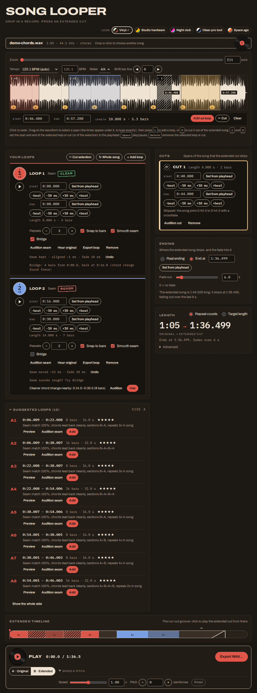 | 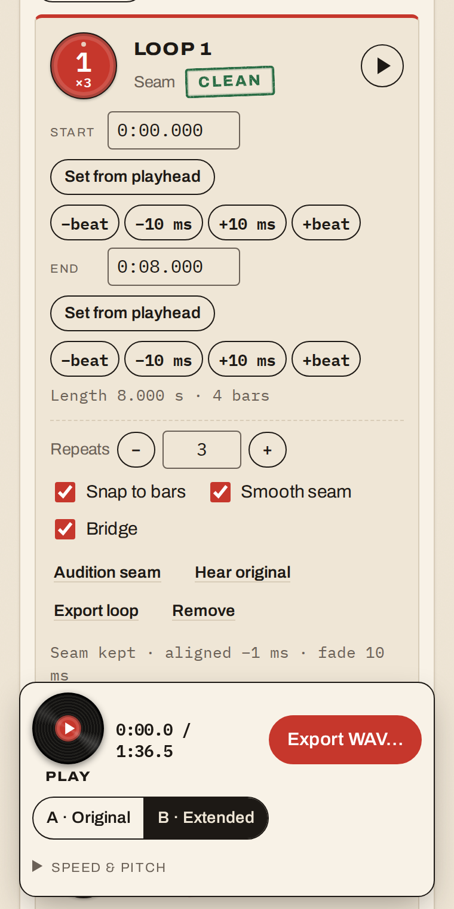 | 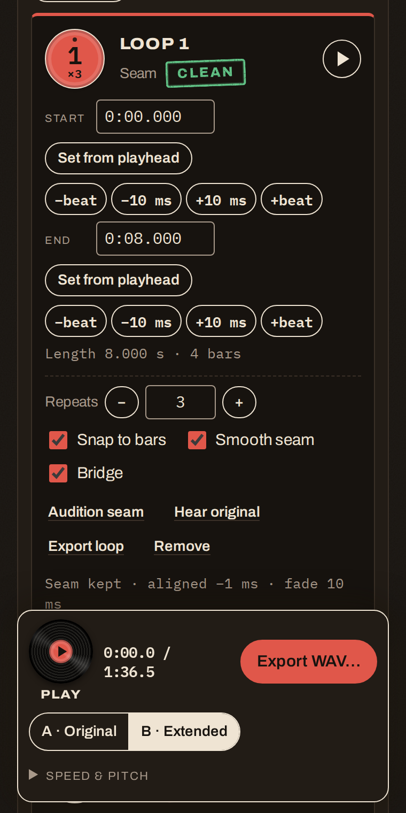 |

The default look is "vinyl and analog": a warm paper page, a spinning record as the play/pause button, record-sleeve
cards for the loops and rubber-stamp seam chips. Four more looks are one click away in the masthead (see
[Looks](#looks)):

| | Light | Dark |
|---|---|---|
| **Vinyl** | 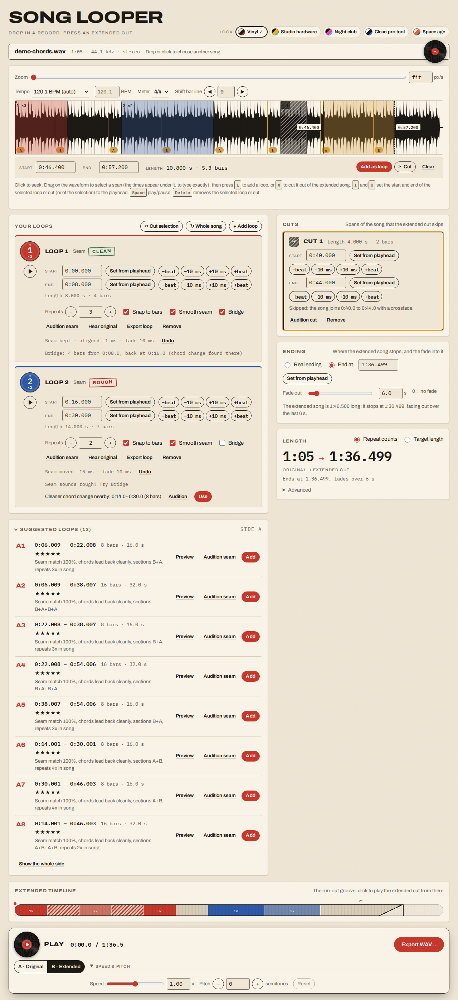 | 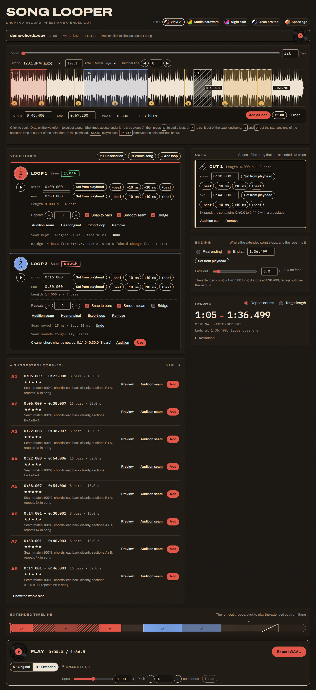 |
| **Clean pro tool** | 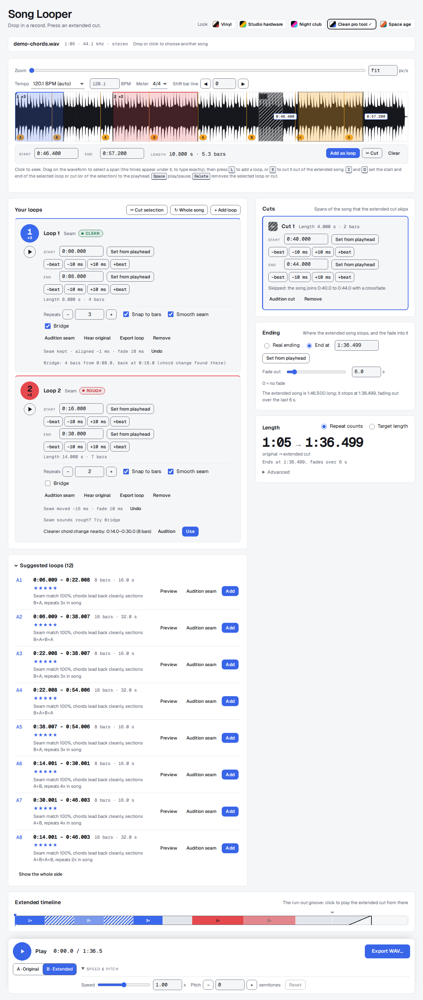 | 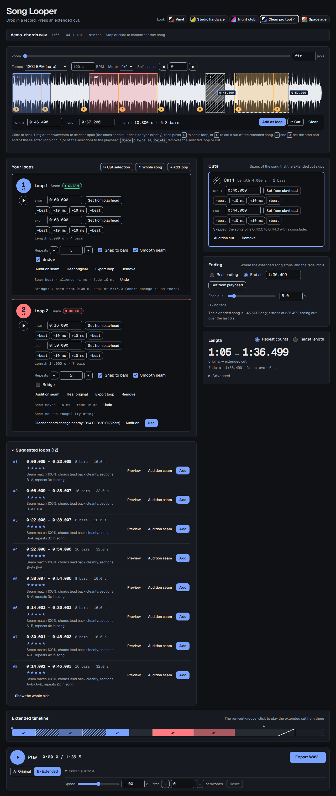 |
| **Space age** | 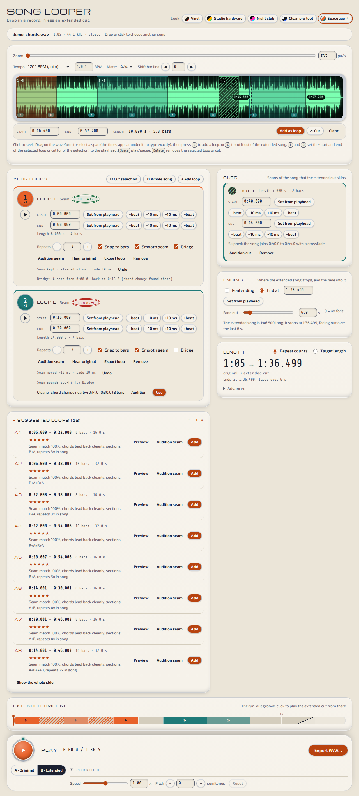 | 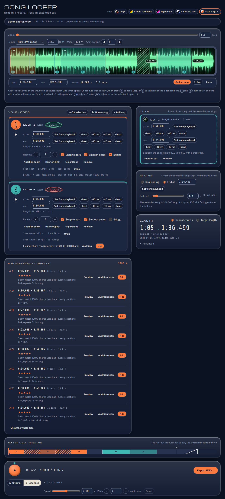 |
| **Studio hardware** (always dark) | | 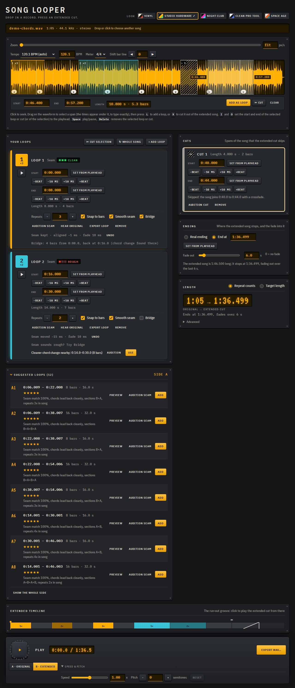 |
| **Night club** (always dark) | | 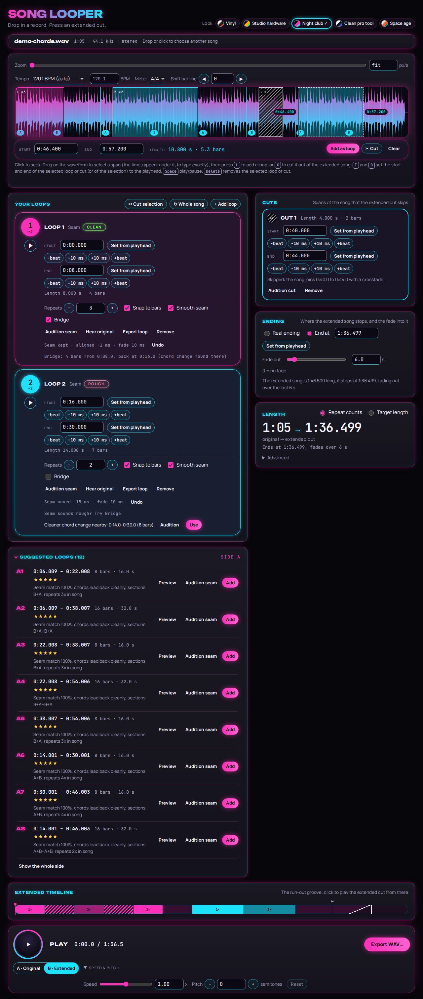 |

Every look also has a phone picture next to these in `docs/themes/` (`<look>-<mode>-phone.png`). See
[Design notes](#design-notes).

## What it does

- Loads mp3, wav, m4a/aac, flac, ogg or anything else your browser's `decodeAudioData` accepts, and keeps the
  file's native sample rate and channel count for rendering and export. When the browser can't decode an m4a or
  .aac file (Chrome and Firefox never decode Apple Lossless, and some Chromium and Linux Firefox builds lack AAC),
  a bundled decoder takes over. It loads only when needed. Copy-protected files (Apple Music downloads) get a
  clear error, since nothing can decode them.
- Analyses the song in a Web Worker: beats, tempo (with a half/double override), bars, sections (A, B, C, ...)
  and a ranked list of loop suggestions, each with a one-line reason.
- Shows the waveform (wavesurfer.js v7 + Regions plugin) with the beat and bar grid and section markers. Drag on
  it to select a span, press `L` to turn the selection into a loop, drag edges to fine-tune (they snap to bars, or
  beats; hold Shift to turn snapping off). Loops cannot overlap.
- Each loop has its own start and end, typed to the millisecond (see [Exact loop times](#exact-loop-times)), and
  its own repeat count (1 to 9,999). Or set a target length and let the app choose repeat counts.
- A selection on the waveform has its own bar with the start and end to type, its length, and Add as loop, Cut and Clear,
  and timestamps at its edges. See [The selection bar](#the-selection-bar).
- Saves any one loop as an audio file of its own, repeated as often as you like and ready to loop in a DAW or sampler.
  See [Export a loop](#export-a-loop).
- Suggested loops is a card you can fold away to its header; it sits directly under Your loops. See
  [Suggested loops: the toggle and where it sits](#suggested-loops-the-toggle-and-where-it-sits).
- Cuts spans out of the song with `X` (or **Cut selection**): the extended song skips them, joined with the same kind of
  crossfade as a loop's seam. See [Cuts](#cuts).
- Ends the extended song early at a time you type, and fades out into it, or trims it to exactly the target length.
  See [Ending](#ending).
- Five looks (themes) with a picker in the masthead, remembered between visits, and a two-column layout on wide windows.
  See [Looks](#looks) and [Layout](#layout).
- Previews the original or the extended song, a loop on repeat, or just the seam (the jump from a loop's end back
  to its start) through the same crossfade code the export uses. A big round record button in the sticky bar plays
  and pauses, and each loop row has its own play button.
- Plays and exports extended songs of any length the WAV format can hold, see [Long songs](#long-songs).
- Smooths the seam of every loop so the join sounds like part of the song, and says how it went with a Clean / OK /
  Rough chip. Optionally bridges a rough seam with a few bars of the song. See
  [How seams are smoothed](#how-seams-are-smoothed).
- Speed (0.5x to 1.5x, tempo only) and pitch (-12 to +12 semitones) for preview, optionally baked into the export.
- Exports 16-bit or 24-bit PCM or 32-bit float WAV.

Keyboard: `Space` play/pause, `L` add a loop at the selection (or at the playhead), `X` cut the selection (or one bar at
the playhead), `I` / `O` set the start / end of the selected loop or cut (or of the selection, when none is selected) to
the playhead, `Delete` remove the selected loop or cut, `Esc` clear the selection.
In a number field: `Up` / `Down` step (`Shift` for 10 times as much, `Alt` for a tenth), `Enter` or leaving the field
applies, `Esc` puts the old value back. The mouse wheel never changes a number.

### Exact loop times

Every loop row has **Start** and **End** fields. Type a time as `75`, `75.25`, `1:15.250` or `1:02:03.5`, press
`Enter`, and the loop edge goes there, to the millisecond. Next to each field are `-1 beat`, `-10 ms`, `+10 ms` and
`+1 beat` nudges, and **Set from playhead** (the `I` and `O` keys do the same for the selected loop). A bad value
(past the end of the song, an end before the start, a loop shorter than 100 ms, or one that would overlap another
loop) is refused with a message under the field and the old value stays.

Typed and nudged times are used as they are: they are never snapped to bars or beats (snapping applies only to
dragging an edge on the waveform). Because smoothing would move the edge, the loop's **Smooth seam** is switched off
when you type, nudge or set from the playhead, and a notice says so. Turning it back on lets the app move the join
again. As in every version, the renderer still moves a loop edge by at most 2 ms to the nearest zero crossing so the
join doesn't click; the fields and the timeline show the time you gave.

### The selection bar

While a span is selected on the waveform (before `L` or `X` turns it into a loop or a cut), a bar sits directly under the
waveform: **Start** and **End** time fields, the **Length** (seconds and bars), and **Add as loop** (`L`), **Cut** (`X`) and
**Clear** (`Esc`). It is hidden when nothing is selected. While you drag a selection out, the fields and the timestamps
follow the mouse.

Type a time (`75`, `75.25`, `1:15.250`) and press `Enter` (or leave the field) and the selection moves there at once. Typed
times are exact and never snapped to bars or beats (only dragging snaps), the parsing and the messages are those of the loop
fields (`Past the end of the song (1:05.000).`, `End must be after start (0:12.335).`), `Up` / `Down` step by 10 ms, and `Esc`
puts the old time back. A selection may sit over a loop or a cut; Add as loop clamps it into the free song, and Cut refuses it
naming what it hits. `I` and `O` set the selection's edges from the playhead when no loop or cut is selected, and the fields
follow.

Small mono **timestamps** (`1:09.600`) sit at the selection's two edges on the waveform, at its middle height (the one band
the loops' and cuts' labels at the top and the beat badges at the bottom leave free): the start to the left of its edge, the
end to the right. They flip to the inside near the edges of the song so that they never run off the waveform, and a selection
narrower than the label `1:09.600–1:12.000` gets that one combined label instead of two. They are drawn in the look's tokens
(`--sel-label-*`: Studio's LCD, Club's neon pill, Space's phosphor, Pro's hairline pill).

### Suggested loops: the toggle and where it sits

The **Suggested loops** card sits directly under **Your loops** in every layout (see [Layout](#layout) for the order). Its
heading is a disclosure button with a chevron and the count, `Suggested loops (12)` (`Finding loops…` while the song is
analysed; the toggle works then too), with `aria-expanded` and `aria-controls`. Closed, the card is only its header, so a
song with dozens of suggestions no longer pushes Cuts, Ending and Length down the page. It is open by default and the choice is
kept across visits in `localStorage` (`song-looper-suggestions-open`, try/catch like the look; with storage blocked the card is
open and the toggle still works). Preview, Audition seam, Add and Show the whole side behave as before.

### Loop the whole song

The **↻ Whole song** button next to **+ Add loop** ties a song's end back to its beginning, so the end of play 1 runs into
the start of play 2 and each play is almost the full song:

```
[intro] [song body] ↩ [song body] ↩ ... [song body] [outro]
  play 1 begins at 0:00          the last play runs on to the real ending
```

It opens a panel inside Your loops with up to three options, best first:

```
Option 1 ★★★★☆  plays 0:15.945 → 1:04.034  keeps 66%
  skips the first 0:15.9 and the last 0:08.5 of each repeat
  Chords lead back cleanly, starts on a section boundary, keeps 66% of the song
  [Audition jump]  [Use this]
```

| Light | Phone, dark |
|---|---|
| 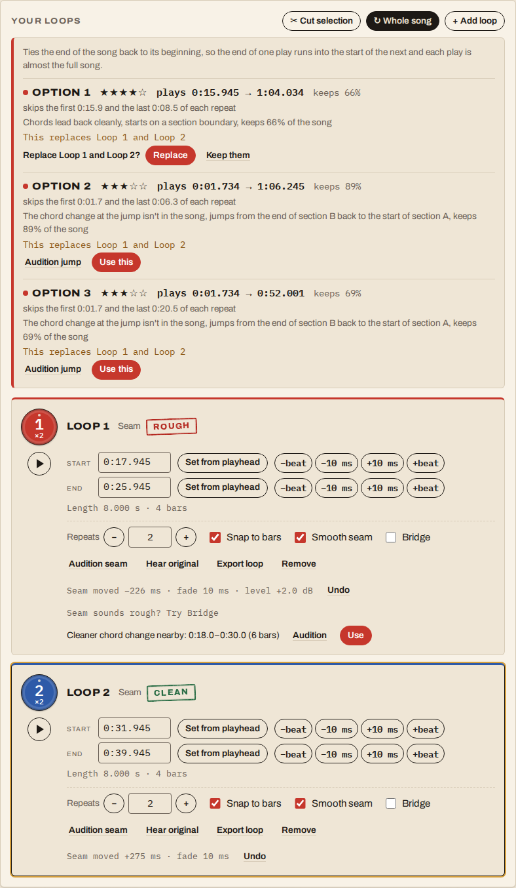 | 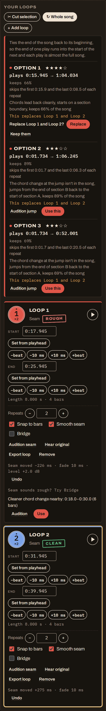 |

*A synthetic song with an 8-bar intro, the body A B A B C A and a 4-bar outro, and two loops inside the first option: it
says `This replaces Loop 1 and Loop 2` and, after Use this, asks Replace / Keep them in the panel.*

The loop starts just after the intro and ends just before the outro (both on bar lines), so the jump goes from near the end
of the song back to near its start at a point where the beat position, the chord change and the energy match.
**Audition jump** plays 4 s before the end point and then 4 s from the start point through the normal seam code (the same
as Audition seam, so the smoothed seam is what you hear). **Use this** adds the option as an ordinary loop with **2 plays**,
labelled **Whole song** on its card, and its repeat field reads **Plays** (each repeat is a full play; the card goes back to
Repeats and loses the label if you shorten the loop under 60% of the song). From then on typed times, nudges, Smooth seam,
Bridge, Export loop, cuts outside the loop, the ending and the target length (make it 30 minutes: the plays are solved)
all work as they do for any loop.

- **Other loops can't overlap it.** An option that has loops inside it says `This replaces Loop 1 and Loop 2`, and Use this
  asks in the panel (Replace / Keep them; no browser dialog) before it removes them.
- **Cuts inside it are refused**, as everywhere: the option says `Remove the cut at 1:40.000 first` and Use this is disabled
  until the cut is gone. Cuts outside it are fine.
- **No options** (`The song is too short to loop as a whole`; `No steady beat found. Drag a selection from just after the
  intro to just before the outro and press L.`; or, for a song with a beat where no pair of bar lines gave a natural jump,
  `No way of looping this whole song sounded natural.` and the same hint): the panel says why.

The search (`src/analysis/wholeSong.ts`, `Analysis.wholeSong`) scores every pair of bar starts `(a, b)` where `a` is in the
first `startWindow` of the song and `b` in the last `endWindow` (each the smaller of 30% of the song and 90 s), `b - a` is a
whole number of bars, and `(b - a) / duration` is at least 60%:

```
score = 0.45 x seam + 0.25 x structure + 0.15 x energy + 0.15 x coverage
```

The seam, the structure term (1 when both ends are on section boundaries, 0.5 for one) and the energy term are the ones the
suggestions use (`seamOfLoop`, `structureScore`, `energyContinuity`: the context match and the harmony of the jump from the
last beat before `b` back to the beat at `a`); coverage is the share of the song each play keeps. Two options may not be
within 2 bars of each other at both edges, and the top 3 are kept. Every weight and window is in `config.ts` under
`wholeSong`. The search costs a few tens of milliseconds on top of a five-minute song's analysis (about 1.5 s in total here,
against the 5 s budget).

### Export a loop

Every loop card has an **Export loop** button that saves that loop as an audio file of its own. The dialog is the export
dialog (bit depth, the speed and pitch bake box, the file name) plus:

- **Repeats in the file** (1 to 9,999, default 1): N passes of the loop with the app's normal seam between them. It is the same
  renderer as the preview and the extended export, over a plan with just that loop: the file is exactly the stretch of
  `renderRange` that starts at the loop and holds its repeats. A loop whose **Smooth seam** has rotated it contributes the
  rotated span (`loopStart` to `loopEnd` of its seam plan), with its own jump and fade between passes.
- **Loop-ready file** (default on): the file's last W samples are crossfaded with the song just before the loop's start (the
  `orig[start - W, start)` stretch), equal-power with the adaptive law every seam uses, so a DAW, sampler or player that repeats
  the file end-to-start hears the song's own lead-in into the loop's first sample instead of a jump. W is the **Seam fade**
  setting, never under 10 ms. Where the song does not reach back W samples (a loop at the very start) the missing part is
  silence, so that stretch fades out.
- **Not in the file:** a loop's **Bridge** (the dialog says so when Bridge is on), and the song's cuts and ending.
- The default name is `<song name> - Loop <n> (<start>-<end>).wav`, with the times as `m.ss.mmm` (`My Song - Loop 2
  (1.09.600-1.12.000).wav`): a colon is not allowed in a Windows file name, and any other character a file system refuses is
  replaced.

It goes through the same piece-by-piece export as the song (about 10 s at a time, nothing held whole, Cancel works), the same WAV
size check (9,999 repeats of a long loop can be more than a WAV holds, and the dialog says so before Export), and
`src/audio/save.ts` (zipped inside a claude.ai artifact). With speed and pitch baked in, the whole file is stretched after the
wrap crossfade, so the join is as clean as the stretch leaves it.

### Cuts

A **cut** is a span of the song that the extended song leaves out: a verse you don't want, a count-in, a dead stretch.
Drag on the waveform and press `X` (or **Cut selection** in the Cuts card). Cuts show on the waveform as hatched spans,
and on the extended timeline as a scissors mark where the join is. With nothing selected, `X` opens a one-bar cut at the
playhead (in the next free stretch of the song if the playhead is in a loop or a cut) for you to set with the time
fields.

- A cut has its own **Start** and **End** fields with the same typing, nudges, **Set from playhead** and error messages
  as a loop (`I` / `O` and `Delete` work on a selected cut too). It is at least 50 ms, and it cannot overlap a loop or
  another cut: the app says which. Cut edges are dragged on the waveform like loop edges (bars by default, `Shift` for
  free), and typed times are never snapped.
- **Joins.** Where a cut meets the song the two sides get a short crossfade, and the join is snapped to
  a zero crossing (at most 2 ms) so it doesn't click. A cut at the very start (the intro goes) makes the extended song
  fade in over 10 ms, and a cut at the very end (the outro goes) fades out over 10 ms, unless an explicit
  [fade](#ending) takes over.
- **Audition cut** plays 4 s before the join through 4 s after it, through the same renderer the export uses.
- Cuts are in **original time**; the extended timeline, the playhead, the length panel, the target-length solver (it
  counts the song without its cuts when it picks repeats) and the WAV all use the song as it is after the cuts. A
  loop's repeats are added to that.

### Ending

The **Ending** card says where the extended song stops. **Real ending** plays to the end of the song (with its cuts and
repeats taken into account). **End at** stops the extended song at a time you type on the extended timeline
(`14:20.000`, `14:20` or `860`; **Set from playhead** uses the extended playhead). **Fade out** is 0 to 60 s, from the
number field or the slider: a cosine fade that reaches silence on the last sample, so the song ends cleanly at a time
you chose, and at the real ending too.

- In target-length mode, **End exactly at target** trims the song to the target and fades into that point; End at then
  follows the target (the card says so) until you type your own.
- An End at later than the extended song, or a fade longer than the song up to its end, is refused with a message. When
  a later change (a cut, fewer repeats) shortens the song below End at, the song goes back to its real ending and a
  notice says so; a fade that no longer fits is shortened the same way.
- Everything follows the final length: the timeline strip shows the fade and the end point, the length panel and the WAV
  size cap use the length after cuts and End at, and the 9,999-repeat limit and the chunked export and preview work on
  that length as well.

Cuts and the ending are in the same renderer (`renderRange`) as loops, so preview, export and audition play exactly the
same samples.

### Numbers

Every adjustable number (loop start and end, repeats, target length, speed, pitch, BPM override, bar-line shift,
waveform zoom and the seam fade) is the same field: type it, step it with the arrow keys, or use its slider or
`-`/`+` buttons, which stay in step with it. Holding a stepper button speeds up after a moment.

### Long songs

- **Repeats** go up to 9,999 per loop. There is no time limit on the extended song. The only limit is the WAV file
  itself: sizes are 32-bit, so a file is under 4 GB. The length panel shows the longest extended song for the chosen
  bit depth (for a 44.1 kHz stereo song about 6 h 45 min at 16-bit, 4 h 30 min at 24-bit and 3 h 22 min at 32-bit
  float), and a plan that goes over says so, with Export disabled until you change the repeats, the target or the
  bit depth. The target-length solver never goes over it.
- **Export** renders the song in pieces of about 10 s (`renderRange`), writes each piece into the file as it is made,
  and never holds the whole song in memory. It shows progress with the elapsed and remaining time and has a **Cancel**
  button that stops the work and frees what was written. The pieces are bit-identical to the same stretch of one big
  render. Inside a claude.ai artifact the file is zipped for saving, and the zip is also kept under 4 GB.
- **Preview** of the extended song plays in 5 s chunks that are started back to back (three ahead), through the same
  renderer and the same speed/pitch node, so a very long song starts quickly, seeks anywhere and changes speed and
  pitch while playing, with no gap or click at the joins.

## Run it locally

Needs Node 20.19 or newer (22 is what CI uses).

```sh
npm install
npm run dev          # http://localhost:5173
```

No music handy? Generate a synthetic demo song (chord loops A B A B C A over a kick) and drop it in:

```sh
npm run demo-song    # writes tests/fixtures/demo-song.generated.wav (git-ignored)
```

## Scripts

| Command | What it does |
|---|---|
| `npm run dev` | Vite dev server |
| `npm run build` | Typecheck, then build the static site into `dist/` |
| `npm run preview` | Serve the built site |
| `npm run lint` | ESLint (flat config) |
| `npm run typecheck` | `tsc --noEmit` (strict) |
| `npm test` | Vitest unit tests |
| `npm run test:e2e` | Playwright end-to-end tests (builds and serves the site first) |
| `npm run demo-song` | Write a synthetic demo song WAV |
| `BIG_EXPORT_SECONDS=14400 npx playwright test big-export` | Opt-in: export a very long extended song through the real UI and check the WAV header against the file on disk (`BIG_EXPORT_BITS=16\|24\|32`, `BIG_EXPORT_ARTIFACT=1` to save it zipped as a claude.ai artifact would) |
| `npm run contrast` | WCAG AA contrast of every look's text colours in every mode (also a unit test); exits non-zero on a failure |
| `npx tsx scripts/mirror-fonts.ts <folder>` | Download every look's Google Fonts stylesheet and font files into a folder, for screenshots and the real-fonts check on a machine whose browser can't reach Google Fonts |
| `SCREENSHOT=1 npx playwright test screenshot` | Regenerate the pictures in `docs/`: the four README screenshots, `docs/whole-song*.png` and `docs/themes/` (every look, every mode, wide and phone) |
| `FONTS_DIR=<folder> npx playwright test layout-fonts` | Run the overlap guard in every look with the real fonts (skipped without `FONTS_DIR`) |

## Tests

- **Unit (Vitest)** run against audio that the tests synthesise (`tests/fixtures/synth.ts`): click tracks at
  100/120/140 BPM (tempo within +-1 BPM, beats within 30 ms), a synthetic A B A B C A song (the top candidate must
  start and end on the A/B boundaries and an A or A+B loop must be in the top 3), other structures and tempos, 3/4,
  the timeline and render maths, seam crossfade continuity, zero-crossing snapping, the target-length solver, the
  WAV encoder, sample-rate sniffing and the offline SoundTouch stretch. The seam work is tested on songs built
  from named chord progressions (one chord per bar over a kick, also in `synth.ts`): the harmony of the same loop
  with and without the chord change in the song, suggestions, rotation (length unchanged, never more than a beat,
  lands before a hit), micro-alignment (a +15 ms edge recovered within 2 ms, one onset in the seam window), the fade
  limit at poor harmony, the level step after a 3 dB crescendo, bridge search, render length and target solver, Undo,
  and how stale seam data is dropped when the tempo, meter or bar lines change. The long-song work has its own
  tests: `renderRange` equals the same stretch of a reference full render bit for bit (plain loops, seam plans with
  bridges, level ramps and fades longer than the piece, loops at the song's edges, mono and three channels; ranges
  around every jump, random short and long ranges, and consecutive pieces joined), the export pieces equal one
  full render (also with speed and pitch baked in), the WAV encoder and zip layout at the 4 GB edges (without
  allocating the file), the number parser and formatter, and the chunk scheduler of the live preview against a fake
  audio context (each chunk starts when the last ends, three queued ahead, seek, speed, late renders). The design
  tokens have a WCAG contrast test (4.5:1 for text, 3:1 for stamp borders, both papers, both themes) and a check that
  the two dark blocks in `style.css` say the same thing. v1.3 added: the cut model (merging, clipping to the free
  song, the join pieces, leading and trailing cuts), the ending (the end point, the cosine fade, which is 1 on the
  first sample, about 0.707 in the middle and exactly 0 on the last), and an independent reference renderer written a
  different way (walk the song, lay loops and cuts in order, decide a jump by "does this part start where the last one
  ended") that `renderRange` must equal sample for sample, whole and in ranges, with cuts at the start, the middle
  and the end, the ending alone and with a fade longer than a piece; the target solver with a minimum; and the
  contrast of every look's tokens. The addendum (loop export, selection bar) added: the loop file is the matching span of
  `renderRange` for a plan with just that loop, bit for bit with Loop-ready off (1, 2, 4 and 7 repeats; a plain loop, a
  smoothed and rotated one, one with a bridge, loops at the very start and end of the song), pieces of any size join into the
  whole file, and Loop-ready changes only the last W samples (W is the Seam fade, at least 10 ms) by the equal-power law
  (checked against the formula) and fades out where the song does not reach back far enough; a loop-ready file joined to
  itself steps by 0.012 where the song's own largest step is 0.057 (the plain file jumps by 0.121, over twice that), and nothing
  within W of the join steps more than the song does; the export pieces equal the loop file encoded in one go at every bit
  depth, the WAV cap check refuses 9,999 repeats of a long loop before writing anything; file names are sanitised; and the
  placement of the timestamps at a selection's edges over a sweep of selections and widths, and the selection's messages.
- **End to end (Playwright, Chromium)**: load a generated WAV, select a span, add a loop, repeat it, export,
  and check the downloaded WAV's header and duration (and decode it with `decodeAudioData`); suggestions, preview,
  seam audition, snapping, target-length mode, the timeline strip, live speed/pitch (through the real AudioWorklet),
  baked export, the seam chip, Undo, nearby loops, bridges (chip, hatched strip, export length), error and edge
  cases, a 380 px layout check in light and dark mode, saving as a claude.ai artifact, and serving the built site
  from a GitHub Pages style sub-path. v1.2 added: typed and nudged loop times, `I`/`O` keys and the Smooth seam
  notice; every number field (typing, steppers, slider sync, bad values); a long export that is checked piece by
  piece and cancelled part way; the live preview (plays and seeks at 500 repeats, changes speed and pitch while it
  plays, and the scheduler run on an `OfflineAudioContext` must give the samples of `renderRange` over the same span:
  identical at the song's own sample rate, no tick at any join at 48 kHz and 32 kHz); and the design (the record spins at 1.8 s / speed and stops at the same angle, reduced motion, no horizontal scroll
  at 380 px, nothing sticking out of its card, both themes, fonts blocked). v1.3 added: the layout guard in every
  look (above); cuts (drag, `X`, typed and nudged times, refusals, intro and outro cuts, Audition cut, and an export
  whose WAV is as long as the timeline says, with the preview and the export the same samples); the ending (End at,
  the fade, the last samples of the exported WAV reaching zero, End exactly at target, the notice when a change
  shortens the song under it); the two-column layout at 1100 px and the one-column order below it; the picker (every
  look sets `data-skin`, survives a reload, keyboard use, no errors, playback continues through a switch) and each
  look's tokens and signature details (Pro's hairlines, Studio's LEDs and LCD, Club's beat pulse, Space's scope and
  orbit); and fonts blocked in every look. The addendum added: the Suggested loops toggle (the count, collapsing to the
  header, kept across a reload, `Finding loops…` while the song is analysed, the keyboard, blocked storage) and the new card
  order in both layouts; the selection bar (it appears under the waveform with the dragged span's times, length and
  buttons, follows the drag live, typed times move the region exactly and never snap, `Esc` and bad values, Add as loop,
  Cut, `L` and `X` use the typed times exactly, `I` and `O`, the timestamps flipped inside at the song's edges and
  combined when narrow, a 320 px phone) and the layout guard with a selection (it also checks the timestamps, which live
  inside the waveform's shadow tree); and Export loop (the dialog's options and default name, a name with a colon and
  other characters a file system refuses, 1 repeat loop-ready and 4 repeats with the durations and the first pass equal
  to the 1-repeat file, the loop-ready join against a loop whose edges do not match, the Smooth seam plan's rotated span
  with a bridge left out, the repeats' validation, estimate and WAV cap, baked speed and pitch, Cancel, and a zip inside
  an artifact). v1.4 added: the whole-song search on a synthetic song with an 8-bar intro, the body A B A B C A and a 4-bar
  outro whose chords differ from the intro's (the top option starts at the end of the intro and ends at the start of the
  outro, within a bar; every option is bar-aligned, inside the search windows and keeps at least 60%; best first, no two
  within 2 bars at both edges; nothing for a song under 20 s, for silence or without a steady beat; a five-minute song,
  also at a fast tempo, stays under the 5 s budget with the search in it), a whole-song loop with N plays rendering as
  `D + (N - 1) x (end - start)` with `renderRange` equal to the full render, the conflict rules and their texts; and in the
  browser the panel (one to three options with times, skipped time and reason, the hover highlight, Audition jump playing),
  Use this (the Whole song label, 2 plays, the Plays field, the extended length and the exported WAV's duration, typed times,
  a 30-minute target), the in-page replace confirmation with no browser dialog, a cut inside an option disabling it, a cut
  outside leaving it alone, and the messages for a short song and a song with no steady beat. The layout guard also runs the
  panel in every look (blocked by a cut, asking to replace loops, and with the loop it added).

Playwright is pinned to 1.56.x so that its Chromium revision matches the browser pre-installed in this
environment under `PLAYWRIGHT_BROWSERS_PATH`. To use another browser, set `CHROMIUM_PATH` to its executable.

The e2e tests stub the Google Fonts stylesheet (`tests/e2e/fixtures.ts`), so they never depend on the network and the
app falls back to its system fonts there. `SCREENSHOT=1 npx playwright test screenshot` regenerates the pictures in
`docs/`: the four README screenshots and `docs/themes/<look>-<mode>-<wide|phone>.png` for every look and mode (Studio
and Club are dark only, so they have a dark picture only). To get the real fonts in them, and to run the overlap guard
with the real fonts (`layout-fonts.spec.ts`), when the machine can't reach Google Fonts, mirror them once and point
`FONTS_DIR` at the folder:

```sh
npx tsx scripts/mirror-fonts.ts /tmp/fonts       # curl needs to reach fonts.googleapis.com and fonts.gstatic.com
FONTS_DIR=/tmp/fonts SCREENSHOT=1 npx playwright test screenshot
FONTS_DIR=/tmp/fonts npx playwright test layout-fonts
```

Each picture is taken only after its look's fonts have loaded, and the faces it used are printed next to its file name.

`big-export` writes a real file of up to 4 GB, so it is opt-in. It uses a persistent browser profile because
Chromium's default test contexts keep blobs in memory only and cannot hold more than about 2 GiB.

## Deploy (GitHub Pages)

`vite.config.ts` uses `base: './'`, so every asset URL is relative and the same build works at
`https://<user>.github.io/<repo>/` (and is tested from a sub-path).

`.github/workflows/deploy.yml` runs lint, typecheck, unit tests and the build on every push to `main`, then
publishes `dist/` with the official `actions/configure-pages`, `actions/upload-pages-artifact` and
`actions/deploy-pages`. One-time setup: in the repository settings, set **Pages > Source** to **GitHub Actions**.
The workflow can also be run by hand from the Actions tab.

### Running as a claude.ai artifact

The same build also runs as a claude.ai artifact. A page there can't start downloads itself, so
`src/audio/save.ts` asks the host through `claude.use("downloads")`. That save dialog accepts `.zip` but not
`.wav`, so inside an artifact the export arrives as a zip holding the WAV (a loop with seam smoothing and a bridge
included). Everywhere else it's a plain WAV download. The build is one `index.html` plus files under `assets/`, all
referenced by relative URLs (`base: './'`): the analysis worker (which also does the seam work), the render worker,
the SoundTouch worklet and the lazily loaded AAC decoder. The seam features added no extra files or dependencies.

## How loop suggestions work

All of this is plain TypeScript in `src/analysis/` (pure functions, no Essentia, no WASM) and every weight and
threshold lives in `src/analysis/config.ts`.

1. **Mono, 22.05 kHz** audio goes to a worker. An STFT (Hann 2048, hop 512) is computed once, in a single pass
   that also extracts per-frame chroma, log-mel and low-frequency energy.
2. **Onset strength**: log-compressed spectral flux, minus a 0.5 s local mean, clipped and normalised.
3. **Tempo**: autocorrelation of the (mean-removed) onset envelope over 60 to 200 BPM, weighted by a log-normal
   prior around 120 BPM. The runner-up tempo is kept for the half/double override.
4. **Beats**: Ellis dynamic-programming tracker (as in `librosa.beat.beat_track`). Because the coarse frames make
   onsets peak early, each beat is then refined on a fine-resolution onset curve; if kick-drum onsets are clearly
   stronger half a beat away, the beats move there (this stops the tracker locking onto off-beat hi-hats).
5. **Bars**: the bar phase with the strongest onset + bass energy on its downbeats. You can switch to 3/4 or 6/8
   and nudge the bar line by a beat; only this stage and the ones after it re-run.
6. **Features per beat**: chroma (12, L2-normalised), timbre (MFCC 1 to 13, z-scored) and loudness, weighted
   `[chroma * 1.0, timbre * 0.6]`.
7. **Self-similarity**: cosine similarity of the features stacked with the next 4 beats, so it compares short
   phrases.
8. **Sections**: a Gaussian-tapered checkerboard kernel slid along the diagonal (at two scales, combined with a
   geometric mean), prominent peaks snapped to bar lines, then agglomerative clustering labels them A, B, C in
   order of first appearance. The label that repeats most gets a cautious "likely chorus" hint.
9. **Candidates**: every bar-aligned pair `(a, b)` of 2 to 32 bars (at least 4 s, at most half the song) is scored
   0.5 x seam + 0.25 x structure + 0.15 x energy continuity + 0.10 x length preference. The seam is half
   *context match* and half *harmony*. Context match is the better of two means over four beats: `S[a-1-j][b-1-j]`
   (the lead-ins match) and `S[a+j][b+j]` (the continuations match). Harmony asks whether the song itself makes the
   chord change from the beat before `b` to the beat at `a` (see [How seams are smoothed](#how-seams-are-smoothed)). Overlapping near-duplicates are suppressed
   and the top 12 are kept, each with a reason such as "Seam match 100%, chords lead back cleanly, sections B+A".

### Splicing

`buildTimeline` lays out `[0, r1.start) -> r1 x n -> [r1.end, r2.start) -> ...`; `renderExtended` copies it
sample by sample. Loop edges first snap to the nearest zero crossing (+-2 ms, on the mid channel, both channels
moved together). Each jump from a loop's end back to its start gets an equal-power crossfade (20 ms by default,
"Seam smoothing" under Advanced), which blends toward equal-gain when the two sides are highly correlated, because
a pure equal-power fade of two identical signals would swell by 3 dB. A loop with **Smooth seam** on (the default)
picks its own fade length instead, as described below, and the "Seam smoothing" length applies to loops with it off.
Preview and export use the same renderer, so what you hear is what you get.

### Speed and pitch

Preview runs through `@soundtouchjs/audio-worklet` (an AudioWorklet `SoundTouchNode`; tempo is driven by the
source's `playbackRate` and the worklet compensates pitch). The node is only in the signal path when speed or
pitch is not neutral. Exporting with "Apply speed and pitch changes" ticked processes the rendered channels with
`@soundtouchjs/core` inside the render worker (a WSOLA stretch stage plus the rate transposer), with progress.

## How seams are smoothed

A loop sounds seamless when the end leads back into the start the way the song itself would. A crossfade can't give
you that: it blends two sounds, so when the chords on either side of the seam clash, a longer fade only lets you
hear both chords at once. The app therefore works on **where** the seam is, and uses the fade only for timing and
timbre. Everything is signal processing on data the analysis worker already has. There is no AI model and no
generated audio, and none of it needs a server.

**Does the song make this chord change?** The song shows which chord changes sound natural. Per beat the app has a
12-note chroma vector (which notes are sounding). A jump from beat `x` (the last beat played) to beat `y` (the next
one) is natural if somewhere in the song, two beats that sound like the ones before `x` are followed by two beats
that sound like the ones from `y`. The score is the mean of the two best such places that are at least a bar apart
(a place that matches almost exactly stands on its own, so a chord change the song makes once still counts). The
number is then measured against the song's own random jumps: the median jump scores 0 and the 95th percentile
scores 1, so a song that sits on one chord doesn't make everything look natural. A song with no spread at all
scores every seam 1 and lets the other two scores decide. Take a song that plays C G Am F, Dm Em F G, then both
again, one chord per bar. A loop of the first four bars ends on F and returns to C, F to C never happens in the
song, and the loop scores 0. A loop of all eight bars ends on G and returns to C, G to C happens (where the second
round starts), and it scores 1.

**The Seam chip.** Each loop's seam gets three scores: how well it hides in front of a drum hit, how close the
spectrum across the seam is to the song's own at that point in the bar, and the harmony above. Quality is 0.25 hit
+ 0.25 spectrum + 0.5 harmony, because the chord is what you hear. 70% or more reads **Clean**, 55% or more
**OK**, anything below **Rough**. The tooltip shows the numbers before and after smoothing. Without a steady beat
there is no harmony score and the chip comes from the other two.

**Smooth seam** (a checkbox on each loop, on by default) does four things. The loop's own start and end stay
exactly where you put them; the app only changes how the jump is played, so it can show what it did and **Undo**
is exact.

1. *Rotation.* Both edges shift together by up to a beat either way, so the loop keeps its exact length and the
   groove doesn't change. Quarter-beat positions are tried, the two best are refined in 5 ms steps within 30 ms,
   and each is scored on a hit just after the seam (0.4), spectral continuity (0.4) and harmony (0.2), with a small
   cost for moving. A seam that is already fine stays where it is. The edges never leave the free space around the
   loop.
2. *Micro-alignment.* The end edge alone moves by at most 20 ms, to where the fine onset curves around the two
   edges line up best (the waveform when neither has a hit). This fixes a drum hit that would land twice.
3. *Adaptive fade.* The seam is rendered with 10, 20, 40, 80, 160 ms and one-beat fades, and the shortest one
   whose spectral discontinuity is close to the best wins. When the chord change is not natural (harmony below 0.5)
   only fades of 40 ms or less are allowed.
4. *Level match.* If the last beat and the first beat differ by more than 1.5 dB beyond the song's own accent
   pattern, the last beat of the loop ramps linearly to meet the first. It only applies to repeats that jump back;
   the last pass into the rest of the song is untouched.

The loop row shows a one-line summary such as `Seam moved +61 ms · aligned +7 ms · fade 40 ms`, **Undo** (which
restores the original seam and turns smoothing off for that loop), **Audition seam** (plays the smoothed seam) and
**Hear original** (plays the raw seam for comparison).

**Cleaner chord change nearby.** When a loop's harmony is under 0.5, the app looks for a loop whose start is within
a bar of yours, whose end is within two bars, and that is a whole number of bars long, and picks the one with the
best harmony (the suggestion score breaks ties). It is only offered if it scores at least 0.7 and is clearly better.
The loop row shows it with **Audition** and **Use**. Nothing moves until you click.

**Bridge** (a checkbox on each loop, off by default). When no jump from the loop's end back to its start sounds
natural, the loop can play a few bars of the song after its end and jump back from a place where the song does make
that chord change. The app searches for a path that starts at the loop's last beat and comes back to its first, plays
1 to 4 whole bars beyond the loop and jumps at most twice. A jump has to be one the song makes (harmony 0.5 or more)
and has to land at the same place in the bar as the beat it replaces. The simplest path, carrying on into the song and
jumping back at the bar line where the chord change occurs, is always among the ones considered, and the song's own
continuation wins ties. A bridge is only offered when its weakest jump is at least 0.2 better than the direct seam;
otherwise the row says `No natural bridge found` or `No bridge needed`. Every repeat except the last plays the loop
and then the bridge, every jump in it gets the same smoothing as a plain seam, and the last repeat flows into the rest
of the song as usual. The timeline, the extended length, the target-length solver, the extended timeline strip (bridges
are hatched in the loop's colour), seam audition, loop preview and export all include it.

Seams that read Rough show a "Seam sounds rough? Try Bridge" hint. Stem separation (giving drums, bass and vocals
each their own seam) is not part of this version.

## Layout

Below 1100 px the page is one column, in the order of the page: song, waveform (with the selection bar under it while there is
a selection), Your loops, Suggested loops, Cuts, Ending, Length, extended timeline. From **1100 px** the waveform, its timeline
and the turntable bar stay full width, and under them the cards split into two columns (about 3:2): **Your loops and, directly
under it, Suggested loops** on the left, **Cuts, Ending and Length** on the right, each column its own height (no card is
stretched to its neighbour). Tab order is the reading order in both layouts. There is no horizontal scroll from 320 to 2560 px,
and the sticky bar never covers a card at the bottom of the page: the page's bottom padding follows the bar's height, and the
bar is hidden until a song is loaded.

**Suggested loops** is a collapsible card (see [Suggested loops: the toggle and where it sits](#suggested-loops-the-toggle-and-where-it-sits)):
closed, only its header shows.

`tests/e2e/layout-overlap.spec.ts` runs a layout guard (`tests/e2e/overlap.ts`) in every look and mode: the empty page at
380, 768, 1100 and 1600 px, and a busy one (two loops, a cut, an ending with a fade, then error messages showing and the
advanced and speed panels open, then Suggested loops collapsed, then a wide and a narrow selection with the selection bar and
its timestamps) at 380, 1100 and 1600 px. The fonts-blocked run (`skins-fonts.spec.ts`: every look, the
Google Fonts hosts aborted) and the real-fonts run (`layout-fonts.spec.ts`, with `FONTS_DIR`) add 320 px and 2560 px, and
the real-fonts run 768 px too. The guard finds text that overlaps text or a control, anything that sticks out of its card
or the window, a text field whose value is clipped, a decoration sitting on text, and a bar that covers a card.
The whole-song panel (SPEC-v1.4.md) is audited in three states at the end of each run: open with a cut inside its options, asking to replace loops, and with the loop it adds (at 380, 1100 and 1600 px in the loaded run, 320, 1100 and 2560 px with fonts blocked, 320, 768 and 2560 px with the real fonts). Intentional overlaps (the sleeve's record, the timeline playhead) are listed with `data-overlap-ok`. Export loop's dialog is
checked too (with a bridged loop, so its note shows): at 380, 1100 and 1600 px in the loaded run, at 320 and 1100 px in the
fonts-blocked run and at 320, 380 and 1100 px in the real-fonts run. The dialog is a container like a card (the browser makes
an open modal `position: fixed`, so the guard does not count it as a decoration), and the file-name field is marked
`data-clip-ok` because a name is as long as the song's and scrolls (the default `<song> - Loop <n> (<start>-<end>).wav` is
longer than the field on a phone).

Running it with the real fonts found two layout bugs that the fallback fonts hid, both at 320 px: Export overlapping the
time in the turntable bar, and the speed slider pushing its number out of the bar. Both are fixed (a smaller Export button
and a slider that can shrink; Studio, Club and Space put Export on a row of its own under the pad and the time).

## Looks

The **Look** picker in the masthead chooses one of five looks. The choice is `data-skin` on `<html>`, it is remembered in
`localStorage` (`song-looper-skin`, and an inline script in `index.html` applies it before the first paint), and
switching never reloads the page or stops the song. Every look has the same markup, `data-testid`s and shortcuts: a look
is only tokens, type, borders, decoration and how the play button is drawn, in `src/style.css` (Vinyl, the default) and
`src/skins/*.css` (the others).

| Look | Modes | Play button | Fonts (Google Fonts) |
|---|---|---|---|
| **Vinyl** | light and dark | a spinning record | Archivo, IBM Plex Mono |
| **Studio hardware** | dark only | a square rubber pad ringed with 24 LEDs that chase while it plays, the time on an amber LCD | IBM Plex Sans Condensed, IBM Plex Mono, VT323 |
| **Night club** | dark only | a round button in a magenta-to-cyan neon ring that pulses on each beat | Unbounded, Manrope, JetBrains Mono |
| **Clean pro tool** | light and dark | a solid accent circle | Geist, Geist Mono |
| **Space age** | light and dark | a 72 px orange launch button with an orbit ring and a dot that circles while it plays | Michroma, Exo 2, Share Tech Mono |

Studio and Night club are dark whatever the browser or host says; the other three follow `prefers-color-scheme` and
`data-theme` as before. The waveform draws in the colours of the current look and mode (Space age's window is a CRT scope
with a phosphor trace in both).

**Fonts.** Google Fonts is the only external host. Vinyl's stylesheet is the `<link>` in `index.html`; every other look's
stylesheet is added to the page the first time that look is chosen, so a visitor who never picks Space age never
downloads Michroma. The stylesheets are:

- Studio: `https://fonts.googleapis.com/css2?family=IBM+Plex+Sans+Condensed:wght@500;600&family=IBM+Plex+Mono:wght@400;500;600&family=VT323&display=swap`
- Club: `https://fonts.googleapis.com/css2?family=Unbounded:wght@700;800&family=Manrope:wght@400;500;600;700&family=JetBrains+Mono:wght@400;600&display=swap`
- Pro: `https://fonts.googleapis.com/css2?family=Geist:wght@400;500;600&family=Geist+Mono:wght@400;500&display=swap`
- Space: `https://fonts.googleapis.com/css2?family=Michroma&family=Exo+2:wght@400;500;600;700&family=Share+Tech+Mono&display=swap`

If a request fails every look falls back to the generic families at the end of its font stacks and nothing else changes;
the fonts-blocked tests check that for every look (no overlap, no errors, playback works).

**Contrast.** `npm run contrast` (and a unit test) reads the tokens of every look and mode from the CSS and checks WCAG AA
for the text colours (ink, soft ink, the OK, warning and error text, the red label text) on the panel and on the page,
the text on the red label, on the sticker and on each loop's colour, and the timestamps at a selection's edges on their tag (with
the tag's outline against it at 3:1), and the same texts on the second panel colour that the whole-song panel uses in some looks: 184 pairs (176 of text), none under its minimum. Where a look's
specified accent was a hair under AA with white text (Pro's blue 4.4987:1, Space's orange 3.4:1 and teal 4.07:1) the text
and solid buttons use a slightly darker `--accent-strong`, and the specified colour stays for the rings, the orbit and
the first loop. The lowest pair of each look is
4.52:1 (Vinyl dark), 4.73:1 (Vinyl light), 4.96:1 (Studio), 5.75:1 (Club), 4.54:1 (Pro light), 6.27:1 (Pro dark), 4.79:1
(Space light) and 5.94:1 (Space dark).

**Motion.** Each look has one signature motion (the record, the LED chase, the beat pulse, the orbit dot) and all of them
stop with `prefers-reduced-motion`.

## Design notes

The redesign (SPEC-v1.2.md, sections 6 to 10) is CSS and markup only; no behaviour, `data-testid` or shortcut changed.
The notes below describe Vinyl, the default look; [Looks](#looks) covers the other four.

- **Tokens.** Every colour, font and radius is a custom property defined first on bare `:root` at the top of
  `src/style.css` (the other looks define the same names, first on `:root[data-skin='...']`). Dark mode redefines them in `@media (prefers-color-scheme: dark)` for
  `:root:not([data-theme='light'])` and again for `:root[data-theme='dark']` (the two blocks are identical, which a
  test checks), so the OS setting is followed unless `data-theme` forces light or dark.
- **Type.** Vinyl uses Archivo (variable width 62 to 125 and weight 400 to 800) for headings and body, IBM Plex Mono for
  every time and number, both from Google Fonts, which is the only external host. If the request is blocked the page
  falls back to Arial Narrow and the system fonts and nothing else changes. The other looks bring their own fonts, added
  the first time they are chosen (see [Looks](#looks)).
- **Record.** The big round play/pause is a record with a red label. Playing turns it once every 1.8 s divided by the
  speed (33 1/3 rpm at 1.00x), pausing stops it where it is, and starting is a short "needle drop" (the label
  settles in 150 ms, the spin eases in over 400 ms). With `prefers-reduced-motion` it doesn't turn, and the other
  animations are off too.
- **Cards and stamps.** Suggestions read as a tracklist (A1, A2, ...), each loop is a sleeve card with a round
  label showing its number and repeats in the loop's colour, and the seam result is a rubber stamp:
  Clean (green), OK (amber), Rough (red), text and border at WCAG AA.
- **Accessibility.** Text is at least 4.5:1 on both papers in both themes (unit-tested), colour is never the only
  carrier (stamps and loops carry words and numbers), focus rings are visible, and the page has no horizontal scroll
  at 380 px.

## Project layout

```
index.html
src/
  main.ts  app.ts  model.ts  plan.ts  grid.ts
  ui/        dropzone, waveform, suggestionsPanel, regionsPanel, cutsPanel, endingPanel, edgeEditor, lengthPanel,
             timelineStrip, transport, exportDialog (also Export loop), analysisControls, seamText, numberField, holdRepeat,
             record, loopColors, layout (the two-column arrangement), skins, skinPicker (the looks),
             selectionBar, selectionLabels (where the timestamps at a selection's edges go),
             wholeSongPanel (Loop the whole song)
  skins/     pro.css studio.css club.css space.css   (Vinyl's tokens are at the top of style.css)
  audio/     decode (+ sniff), player, render (renderRange), preview, stream, chunkSource, target, stretch,
             wav, zip, exportPieces, loopExport (one loop as a file), blobAssembler, save, renderClient/worker/protocol
  util/      time, format, store, filename
  analysis/  stft onset tempo beats bars features ssm sections candidates pipeline config worker client
             harmony seam smooth nearby bridge bridgePlan   (seams, see "How seams are smoothed")
             wholeSong   (the whole-song loop search, see "Loop the whole song")
  label/     provider.ts   (LabelProvider interface, no-op default)
tests/       unit/  e2e/  fixtures/
scripts/     make-demo-song.ts  skin-contrast.ts  mirror-fonts.ts
docs/        screenshots, and themes/ (one picture per look, mode and width)
.github/workflows/deploy.yml
```

## Known limits

- Beat and structure analysis is heuristic. Expect octave (half/double) tempo errors on some songs, which the
  tempo menu fixes, and approximate section boundaries on real recordings. Ambient or rubato music gets a
  "No steady beat found" warning and a fixed 0.5 s snapping grid.
- The harmony score comes from the song's own chroma, not from recognising chords, so it only knows chord changes
  that the song itself makes. A song that never repeats a chord change gives every seam a poor score, and a seam in
  a song with no steady beat has no harmony score at all (the chip then rests on the other two scores). Smoothing moves a seam by at most a beat and 20 ms; it
  can't make a bad chord change good (the nearby loop and the bridge are for that, and a bridge only jumps between
  bar positions that match).
- Files over 20 minutes load with a warning. The extended song has no length limit of its own; the WAV format
  does (under 4 GB, so a few hours, depending on bit depth, sample rate and channel count). Inside a claude.ai
  artifact the saved zip has the same limit. Chromium keeps a download that the page builds as a blob; very large
  exports need that much free disk (or, in a private window, memory) in the browser, and a browser that refuses the
  blob ends the export with an error rather than a bad file.
- A cut cannot overlap a loop or another cut (cut around a loop, or shorten it first), and a cut at the very start or end
  fades over 10 ms instead of joining two sides. Cuts and the ending are in the current session only, like loops.
- Studio hardware and Night club are dark looks only; on a light browser they stay dark. The looks' fonts come from
  Google Fonts; without the network (or with the host blocked) the generic fallbacks of each font stack are used, which
  are narrower or wider than the real faces but never overlap (the fonts-blocked tests check that).
- Typed loop times are exact in the interface; the renderer still moves an edge by at most 2 ms to the nearest zero
  crossing.
- A loop file (Export loop) holds the loop only: no bridge, no cuts, no ending. Loop-ready is exact for the file as it is; with
  speed and pitch baked in the whole file is stretched after the wrap crossfade, so the join is as clean as the stretch
  leaves it. The wrap crossfade takes its W from the Seam fade setting (at least 10 ms), not from a Smooth seam's own fade.
  The loop's edges still snap to a zero crossing by at most 2 ms, like everywhere else.
- Cut rows in the narrower side column (Cuts, Ending, Length) keep Start and End one under the other: an edge's field, button
  and nudges need about 330 px, and the 2fr column is never wider than about 550 px.
- Files with more than two channels are stretched pair by pair when speed or pitch is baked in.
- Optional AI labelling of sections and saving loops between sessions are not in v1 (`src/label/provider.ts` is
  the extension point for the former).

## Licences

No licence has been chosen for this repository's own code yet. Runtime dependencies: `wavesurfer.js` (BSD-3-Clause),
`fft.js` (MIT), `@soundtouchjs/*` (MPL-2.0) and `@audio/decode-aac` (the m4a fallback: its AAC decoder is FAAD2
under **GPL-2.0**, its ALAC decoder Apache-2.0). If you publish this app under a licence that isn't GPL-compatible,
swap that fallback for an LGPL one such as an FFmpeg WASM build. Essentia.js (AGPL) and Rubber Band (GPL, needs COOP/COEP headers that
GitHub Pages cannot set) are deliberately not used.
